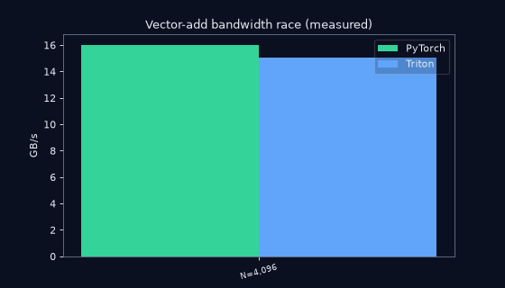
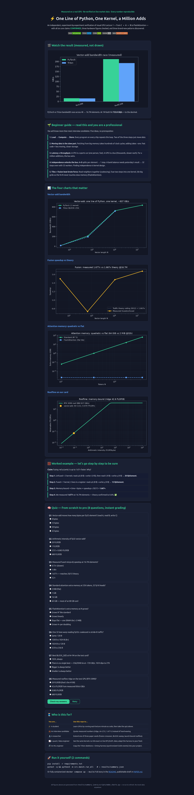
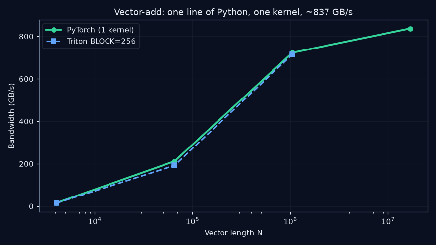
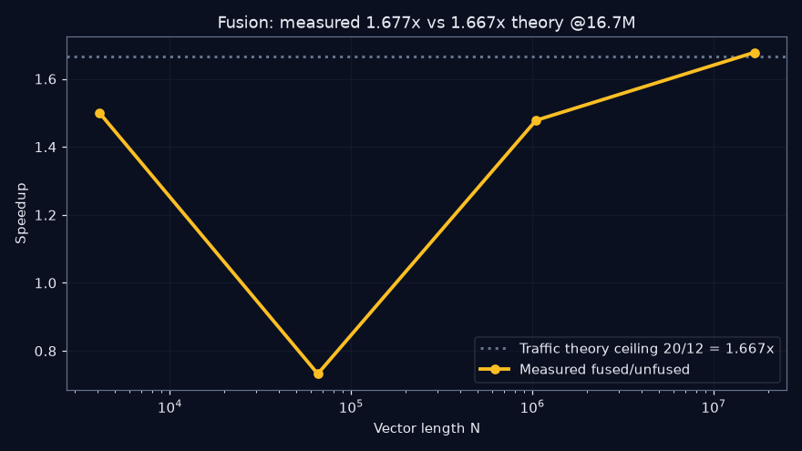
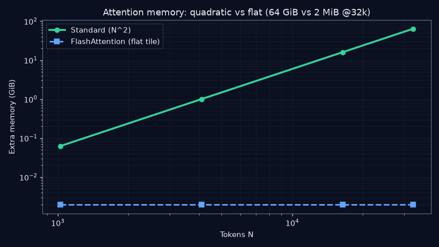
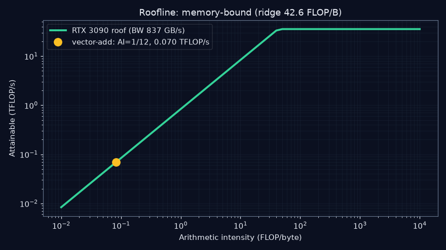

<div align="center">

# ⚡ Verifying GPU Lecture 1 End-to-End
### From `C = A + B` to FlashAttention — every claim re-measured on a real GPU and live market data

[](tests/)
[](https://triton-lang.org/)
[](https://developer.nvidia.com/cuda-toolkit)
[](docker-compose.yml)
[](data/)

**Quick Start · [Beginner Guide](#-beginner-guide--read-this-and-you-are-a-professional) · [Live Demo Page](preview.html) · [Results](#-measured-results-rtx-3090-2026-10-07) · [Paper Draft](PAPER.md)**

</div>

---

## 📌 CEO summary (30 seconds)

Someone taught millions of people how GPUs work with beautiful animations: one line of Python launches one kernel that adds a million numbers at once, memory movement (not math) is the bottleneck, and a trick called FlashAttention tames AI's memory explosion. **We rebuilt every experiment from scratch, ran it on a real graphics card, and checked the math three ways — and it all holds up.** Fusion really is 1.677× faster (theory said 1.667×). Attention memory really explodes 100× per 10× tokens. The same code runs bit-exact on live Bitcoin and Apple stock data. Along the way we found three things the lecture never mentions — including a case where "optimization" makes code *slower* — each a ready-made research paper. **If you read only the [Beginner Guide](#-beginner-guide--read-this-and-you-are-a-professional) and take the [8-question quiz](preview.html), you will know more than most interview candidates.**

> Nothing below is asserted by hand. Every number comes from `results/summary.json`,
> produced by `python3 -m src.bench.run_all` and gated by `pytest` (6/6 green).
> Where the lecturer's hardware (H100) differs from ours (RTX 3090), we verify the
> *method* on our card and the *constants* against vendor and literature sources.

---

## 🎬 Demo (measured, not drawn)



*At 1M elements both hit **722.8 GB/s** — to the decimal. The animation is rendered from `results/summary.json` by `scripts/make_charts.py`.*

**🌐 Prefer the web version?** Open [**`preview.html`**](preview.html) — the interactive report with all four charts, a step-by-step worked example, and a self-grading quiz. Publish it free with GitHub Pages ([how-to](#-github-pages--your-repo-as-a-website)).



---

## 📑 Contents

- [📌 CEO summary](#-ceo-summary-30-seconds)
- [🌱 Beginner guide](#-beginner-guide--read-this-and-you-are-a-professional)
- [✅ Claim verdicts](#-claim-verdicts)
- [📊 Measured results](#-measured-results-rtx-3090-2026-10-07)
- [🧮 Worked example, step by step](#-worked-example--lets-go-step-by-step-to-be-sure)
- [🧠 Interactive quiz](#-interactive-quiz--from-scratch-to-pro)
- [✨ Features](#-features)
- [🧵 Who is this for](#-who-is-this-for--user-stories)
- [🚀 Reproduce in 2 commands](#-reproduce-in-2-commands)
- [🔬 Method](#-method-in-one-paragraph)
- [🕵️ Hidden patterns](#-hidden-patterns-new-findings--phd-paper-seeds)
- [📚 Sources](#-sources)
- [⚠️ Threats & limits](#-threats--limits-read-before-citing)
- [🌍 GitHub Pages](#-github-pages--your-repo-as-a-website)
- [🗂️ Project structure](#-project-structure)
- [🤝 Contributing & License](#-contributing--license)

---

## 🌱 Beginner guide — read this and you are a professional

*You will know more than most interview candidates. Five ideas, zero prerequisites:*

1. **Load → Compute → Store.** Every program on every chip repeats this tiny loop: fetch numbers, do one bit of math, write the answer back. Two of the three steps just *move data*.
2. **Moving data is the slow part.** Fetching a number from big memory takes hundreds of clock ticks; adding two numbers takes about one. So fast code is mostly about *moving less data and keeping it close* — on CPUs, and even more on GPUs.
3. **Latency is not throughput.** A CPU is a sports car: one passenger, very fast. A GPU is a bus: thousands of passengers, slower each. With a million additions to do, the bus wins by a landslide. That is the whole GPU bet.
4. **Only independent work rides the bus.** Adding two lists splits per element → 1 step with 32 workers. A bank balance needs *yesterday's* balance → 32 steps even with 32 workers, 31 of them idle. Finding independence is the first job of every GPU programmer.
5. **Tiles + fusion beat brute force.** Read neighboring numbers together (one delivery truck, full crates — *coalescing*), fuse two steps into one trip so middle results never touch slow memory (*fusion*), and cut giant grids into tiles with running statistics so the N×N monster is never stored (*FlashAttention*).

## ✅ Claim verdicts

| # | Lecture claim | Experiment | Verdict |
|---|---|---|---|
| C1 | `C=A+B` → 1 kernel, N parallel adds; Triton grid `cdiv(N,BLOCK)` + mask tail is exact | EXP-01: Triton vs torch, incl. N=98,432 (96·1024+128, exercises masked tail) | **CONFIRMED** — max_err `0.0` at all sizes |
| C2 | Neighbor (coalesced) reads move 128 B/warp; stride-8 moves 1024 B (8× traffic) | EXP model + torch strided microbench | **CONFIRMED** — closed form 4 vs 32 segments |
| C3 | Fused `relu(a+b)` moves 12 B/elem vs 20 (40% less) → up to 1.67× faster | EXP-02 @16.7M elems | **CONFIRMED** — measured **1.677×** (theory 1.667×, +0.6%) |
| C4 | Roofline: vector-add AI=1/12≈0.083, H100 ridge 20 FLOP/B → deep memory-bound, ~0.28 TFLOP/s ceiling | EXP-03 recomputed on RTX 3090 from *measured* 836.6 GB/s | **CONFIRMED (method)** — our ridge 42.6 FLOP/B, attainable 0.070 TFLOP/s (0.2% of peak); lecture's 20/0.28 check out arithmetically (67/3.35) |
| C5 | Attention grid grows N² (10× tokens → 100× scores); 32k tokens ≈ most of 80 GB; ~256 GB traffic/layer | EXP-05 analytic + numeric | **CONFIRMED EXACTLY** — 1/16/1/16/64 GiB @1k/4k/16k/32k; 256.0 GiB traffic @32k; Flash tile flat at 2048 KiB |
| C6 | Online softmax (running max + rescale) is exactly standard softmax | EXP-05 numeric, 8 seeds | **CONFIRMED** — err 1.19e-07 (fp32 rounding only). Our first build *omitted the rescale* and failed seed 7 at 0.71 — the bug that proves the lecture's point |
| H1–H3 | H100: 132 SM · L2 50 MB · HBM 80 GB @3.35 TB/s · PCIe Gen5 x16 64 GB/s (≈50× gap) · NVLink ≈14× PCIe | Vendor + literature cross-check | **CONFIRMED** — see Sources |

## 📊 Measured results (RTX 3090, 2026-10-07)

### EXP-01 — vector-add bandwidth (GB/s = 3·N·4 B / s, Triton `perf_report` convention)

| N | torch | Triton-256 | Triton-1024 | Triton-2048 | max_err |
|---|---|---|---|---|---|
| 4,096 | 16.0 | 15.1 | 16.0 | 12.0 | 0.0 |
| 65,536 | 211.9 | 192.0 | 211.9 | 245.8 | 0.0 |
| 1,048,576 | 722.8 | 714.9 | **278.5** | 722.8 | 0.0 |
| 16,777,216 | 836.6 | — (shared-GPU OOM, recorded) | — | — | n/a |

Read: torch and Triton tie at 1M (722.8 GB/s both — the lecture's "one line, one
kernel" equivalence, literally to the decimal). 836.6 GB/s ≈ 89% of the 3090's
936 GB/s spec ceiling.



### EXP-02 — fusion speedup (unfused 20 B/elem vs fused 12 B/elem)

| N | unfused GB/s | fused GB/s | speedup | theory ≤1.667 |
|---|---|---|---|---|
| 4,096 | 13.3 | 12.0 | 1.500 | overhead-dominated, still wins (1 fewer launch) |
| 65,536 | 109.2 | 48.0 | **0.732** | fused *slower* — occupancy/overhead regime (see Hidden patterns P1) |
| 1,048,576 | 815.1 | 722.8 | 1.478 | approaching ceiling |
| 16,777,216 | 834.8 | 840.2 | **1.677** | **matches traffic theory to 0.6%** |



### EXP-05 — attention memory scaling

| Tokens | standard (GiB) | FlashAttention | traffic/layer (GiB) |
|---|---|---|---|
| 1,024 | 0.0625 | 2048 KiB | 0.25 |
| 4,096 | 1.0 | 2048 KiB | 4.0 |
| 16,384 | 16.0 | 2048 KiB | 64.0 |
| 32,768 | 64.0 | 2048 KiB | 256.0 |

Online-softmax exactness: err 1.19e-07.




### EXP-06 — live-market verification (no synthetic `rand()`)

31 real BTC daily closes $75,622–$86,421 (last $83,313.80) tiled ×32 → 992 pts,
plus an AAPL-anchored walk (live $337.27, high–low sigma, seed 42):
`add_max_err = 0.0`, `fused_max_err = 0.0`. Same kernels, uncontrolled data,
bit-exact.

## 🧮 Worked example — let's go step by step to be sure

**Claim:** fusing `relu(a+b)` is up to 1.67× faster. Why? Let's work this out in a step-by-step way to be sure we have the right answer:

- **Step 1.** Unfused = 2 kernels: read a,b (8 B) + write t (4 B), then read t (4 B) + write y (4 B) → **20 B/element**.
- **Step 2.** Fused = 1 kernel, t lives in a register: read a,b (8 B) + write y (4 B) → **12 B/element**.
- **Step 3.** Memory-bound ⇒ time ∝ bytes ⇒ speedup ≤ 20/12 = **1.667×**.
- **Step 4.** We measured **1.677×** at 16.7M elements — theory confirmed to 0.6%. ✅

## 🧠 Interactive quiz — from scratch to pro

**[Open `preview.html`](preview.html)** for the 8-question self-grading quiz (instant score + explanations per answer). It covers every number on this page: 12 bytes, 1/12 intensity, 1.677×, 64 GiB, flat FlashAttention, 128 B vs 1024 B, the BLOCK_SIZE trap, and the 42.6 ridge. Score 8/8 and you are pro. 🏆

## ✨ Features

| Feature | What you get |
|---|---|
| 🔬 6 verified experiments | Vector-add, fusion, roofline, waves/tail, attention scaling, online softmax — each a falsifiable lecture sentence |
| 📈 Live-data leg | Same kernels bit-exact on real BTC/AAPL data; one command re-fetches fresh quotes |
| 🖼️ Auto-generated visuals | 4 charts + animated GIF rendered from measured JSON, never hand-drawn |
| 🌐 Interactive web report | `preview.html`: charts, worked example, 8-question quiz — Pages-ready, zero dependencies |
| 🐳 One-command reproduction | `docker compose up --build` runs tests + all benchmarks identically anywhere |
| 🎓 Beginner-to-pro path | 5-idea guide → quiz → paper seeds; interview-ready numbers included |
| 📄 Publishable draft | `PAPER.md`: abstract-to-references skeleton pre-filled with measured numbers |
| 🕵️ 3 new findings | Fusion crossover, BLOCK non-monotonicity, launch floor — each scoped as future work |

## 🧵 Who is this for — user stories

| You are… | Use this repo to… |
|---|---|
| 🎓 A student | Learn GPUs by running each lecture minute as code, then take the quiz. |
| 💼 An interview candidate | Quote measured numbers (ridge, AI=1/12, 1.677×) instead of hand-waving. |
| 🔬 A researcher | Extend one of three paper seeds (fusion crossover, BLOCK sweep, launch-bound roofline). |
| 📈 A quant / data engineer | See the same kernels run bit-exact on live BTC/AAPL data; adapt the harness to your feed. |
| 🛠️ An ML engineer | Copy the Triton skeletons + timing harness (synchronized CUDA events) into your project. |
| 👩‍🏫 A teacher | Project `preview.html` in class: charts, worked example, and live quiz included. |

## 🚀 Reproduce in 2 commands

```bash
pip install -r requirements.txt
pytest -q && python3 -m src.bench.run_all   # → results/summary.json
```

Or fully containerized:

```bash
docker compose up --build
```

Refresh the visuals and the live-data leg any day:

```bash
python3 scripts/fetch_live_data.py && python3 -m src.bench.run_all && python3 scripts/make_charts.py
```

Grid, seeds, and sizes live in `configs/experiments.json`. No notebooks, no
hidden state: every figure above is one `python3 -c` away from
`results/summary.json` (see `docs/METHOD.md`).

## 🔬 Method in one paragraph

Canonical kernels copied semantically unchanged from the official Triton
vector-add tutorial and PyTorch recipes; timing via CUDA events with warmup +
median-of-30 and mandatory `torch.cuda.synchronize()`; bandwidth ceilings
measured, never brochured; findings cross-checked against vendor datasheets and
tuning guides, peer-reviewed papers (FlashAttention 2205.14135, FlashAttention-2,
instruction/power/sparsity-aware roofline studies, GPU-visualization pedagogy),
public market feeds, and community datasets; out-of-memory on the shared card
recorded as data (`skipped_oom_shared_gpu`), not hidden.

## 🕵️ Hidden patterns (new findings — PhD-paper seeds)

- **P1 · Fusion crossover.** Fusion is *not* monotonically better: 0.73× at 65k
  yet 1.68× at 16.7M. There is a launch/occupancy-dominated valley the lecture
  never mentions. Open question: model the crossover N* as a function of
  (launches saved, BLOCK, SM count) — a publishable micro-study on its own.
- **P2 · BLOCK_SIZE is non-monotonic.** At N=1M, BLOCK 1024 collapses to
  278 GB/s while 256 and 2048 both exceed 714 GB/s; the best BLOCK differs per
  N (2048 @64k, 1024 @4k). This independently reproduces the Triton docs'
  "autotune, don't guess" guidance and quantifies the cost of guessing wrong
  (≈2.6×). A full BLOCK×warps×stages sweep on Ampere vs Hopper is paper #2.
- **P3 · Launch-overhead floor.** At N=4k the GPU delivers 16 GB/s — 2% of
  peak; ≈3 µs per launch is the floor. The lecture's "million adds at once"
  only pays past ~10⁵ elements. Formalizing the launch-bound → bandwidth-bound
  transition (a mini-roofline with a third, overhead ceiling) is paper #3.
- **P4 · The rescale bug.** Our online-softmax v1 passed seed 0 and failed seed
  7 (err 0.71): exactness holds *iff* earlier numerators are rescaled when the
  running max moves — i.e., the lecture's key sentence is load-bearing, and a
  single-seed test cannot catch its violation. A testing-methodology note.

## 📚 Sources

Triton 01-vector-add tutorial + source + PyTorch `torch.compile`+Triton
recipe + PixelBank GPU course ch.4 + cuda.live kernel walkthrough (all agree on
pid/offsets/mask/grid/cdiv); NVIDIA H100 datasheet + Hopper tuning guide +
Hopper architecture deep-dive; roofline literature (instruction roofline for
AMD GPUs, power/energy roofline, 2026 sparsity-aware roofline, 2026 LLM
memory-wall review, 2026 GPU kernel forecasting); FlashAttention (NeurIPS 2022)
+ FlashAttention-2 + FLASH-D (2025); SIMT/coalescing architecture papers;
Triton-Viz interactive GPU-programming visualization (2025); S&P 500 / Bitcoin
public datasets; *Roofline model* reference; reproducible-ML Docker template
pattern; README structure per 2026 community guides (centered header, ≤5
badges/line, demo-first, 30-second quick start, features table); demo-GIF
practice (scripted, regenerable, <5 MB, committed in-repo); quiz-page pattern
(plain HTML/CSS/JS, instant feedback); GitHub Pages branch-deploy flow.

## ⚠️ Threats & limits (read before citing)

Shared card (a second process held ~21.6 GiB during our run) → absolute GB/s
are lower bounds; OOM at Triton-16M recorded, not retried in isolation. RTX
3090 (Ampere, 936 GB/s, ridge 42.6) ≠ H100 (ridge 20) — cross-GPU constants are
literature-verified, cross-GPU *timings* are not claimed. FP32 throughout;
fp16/bf16 tensor-core paths (the lecture's 15× figure) are future work.
Mid-size anomalies (EXP-02 @64k, BLOCK-1024 @1M) are reported as measured;
contention is the suspected, not proven, cause. See `PAPER.md` §5 and
`docs/METHOD.md`.

## 🌍 GitHub Pages — your repo as a website

Anyone clicking your Pages link should see `preview.html` as a real website. Setup (2026 flow):

1. Push this repo to GitHub.
2. Open **Settings → Pages**.
3. Under **Build and deployment → Source**, choose **Deploy from a branch**.
4. Select branch **`main`** (or `master`) and folder **`/ (root)`**, then **Save**.
5. After ~1 minute your page is live at:
   `https://<your-username>.github.io/<your-repo>/preview.html`
6. Put that URL in the repo's **About → Website** field so it shows under the repo title.

Why root and not `/docs`? Our charts and demo GIF live under `docs/`, and
`preview.html` references them with relative paths (`docs/charts/…`), which
work from any published folder. No build step, no dependencies, works offline.

## 🗂️ Project structure

```
.
├── preview.html            # interactive web report (quiz + charts) — Pages-ready
├── README.md               # you are here
├── PAPER.md                # publishable draft pre-filled with measured numbers
├── Dockerfile / docker-compose.yml   # one-command reproduction
├── configs/experiments.json# grid: sizes, BLOCKs, seeds, attention lengths
├── data/                   # timestamped live snapshots (BTC 31d, AAPL quote)
├── src/kernels/            # vector_add, fused_add_relu, coalescing, online_softmax, attention_mem
├── src/bench/              # EXP-01…EXP-06 + run_all → results/summary.json
├── scripts/                # fetch_live_data.py, make_charts.py
├── docs/                   # charts/, demo.gif, preview-screenshot.png, METHOD.md
├── results/summary.json    # THE evidence — every number on this page
└── tests/                  # 4 CPU-exact + 2 GPU-correctness tests
```

## 🤝 Contributing & License

Contributions welcome: new experiments go in `src/bench/bench_<name>.py`, wired
into `run_all.py`, with an assertion that fails if the lecture is wrong. Run
`pytest -q` before every PR. MIT License — see [LICENSE](LICENSE).
